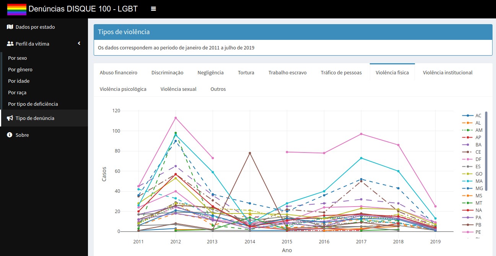

Eu finalmente decidi começar a escrever neste site. Era algo que eu queria há muito tempo, mas sempre atrasava por vários motivos. O início da pandemia do Coronavirus não ajudou em nada ... :-)

Espero escrever todas as semanas sobre diferentes assuntos. A maioria dos posts provavelmente serão alguns tutoriais sobre Python, R, ciência de dados e desenvolvimento de software, pois são essas coisas que me mantêm ocupado durante a semana. No entanto, também posso escrever sobre direitos humanos, educação e tópicos de pesquisa em neurociência e física.

Neste primeiro post apresentarei um pequeno aplicativo que venho desenvolvendo nas últimas semanas.

No início deste ano busquei dados e informações envolvendo crimes contra pessoas LGBT no Brasil. Diz-se que temos uma das maiores taxas de criminalidade do mundo [1](# Referências), mas eu queria ver os dados brutos e talvez tentar ter alguns insights ao estudar séries temporais e eventos correlacionados sobre este assunto.

Tentei entrar em contato com algumas pessoas do [Grupo Gay da Bahia](https://grupogaydabahia.com.br/) mas nunca recebi uma resposta. Conversei com alguns amigos e descobri que crimes contra pessoas LGBT raramente são registrados em documentos oficiais de forma regular. Acabei vasculhando o site do governo federal, notadamente o “Ministério da Família e Direitos Humanos”, mas encontrei apenas suas promessas de disponibilizar dados atualizados e de acesso aberto sobre direitos humanos no Brasil. Em uma página que não está mais acessível, diz-se que as estratégias a serem adotadas para a abertura, suporte, monitoramento e divulgação de seu banco de dados seriam produzidas com prazo até agosto de 2019.

Na verdade, entrei em contato com eles em fevereiro pedindo uma atualização sobre este assunto (o prazo já expirou há cerca de seis meses), mas após dois meses de espera eles apenas disseram que "todas as informações necessárias, cronogramas e bancos de dados a serem utilizados serão em breve publicados". Ou seja: “estamos trabalhando há quase um ano e ainda não temos nada planejado”.

De qualquer forma, durante meu tempo clicando no site do Ministério, descobri que pelo menos ALGUMAS informações são públicas. O governo brasileiro fornece uma linha de ajuda (chamada **"Disque Denúncia"** ou **"Disque Direitos Humanos"** [2](# Referências)) para que as pessoas possam ligar e denunciar abuso doméstico , maus-tratos a crianças e idosos etc. Dentre os diversos perfis disponíveis, é possível ver as ligações provenientes de pessoas LGBT. Existem dados de 2011 a 2019 (apenas parcialmente, pois os dados deste ano cobrem apenas até junho).

Baixei todos os dados da população LGBT [neste link](https://www.gov.br/mdh/pt-br/acesso-a-informacao/ouvidoria/balanco-disque-100). As tabelas de dados são realmente muito completas, mas todos os dados são apenas contagens de casos em várias categorias (sexo, idade, localização ...). Por causa disso, não consegui obter insights sobre ele, mas decidi organizá-lo para tornar mais fácil para as pessoas olharem para algumas tendências.

Para fazer isso, desenvolvi um aplicativo **Shiny** muito simples em **R**. Você pode ver o resultado [aqui](https://gerbortolotto.shinyapps.io/denuncialgbt/) (somente em português). Os dados são separados em guias que representam diferentes perfis de reclamantes. Você pode ver como os casos aumentaram ou diminuíram em diferentes estados brasileiros nos últimos oito anos.

Achei que poderia atualizar este aplicativo conforme novos dados fossem lançados. No entanto, o governo brasileiro mudou a forma como essas informações seriam divulgadas. O último relatório deles resume os casos em [um arquivo pdf](https://www.gov.br/mdh/pt-br/acesso-a-informacao/ouvidoria/Relatorio_Disque_100_2019_.pdf) e não é possível acessar os dados brutos como eu fiz. Se o governo decidir divulgar dados abertos, vou desenvolver um novo aplicativo e tentar fornecer algum tipo de plataforma de fácil acesso. Até lá e sem novos dados acho que este app será apenas um instantâneo das reclamações feitas por LGBT até meados de 2019.

Todos os dados usados no desenvolvimento deste aplicativo podem ser encontrados na minha [página do Github](https://github.com/gbortolotto/lgbtapp) (o código precisa de uma limpeza, não repare ...) e só existe graças a projetos como [Shinyapps.io](https://www.shinyapps.io/).

P.S .: Pretendo escrever em inglês neste site, mas provavelmente traduzirei as postagens sobre este aplicativo, pois ele diz respeito principalmente à população LGBT brasileira.

## Referências

1. [https://en.wikipedia.org/wiki/LGBT_rights_in_Brazil#Anti-LGBT_violence](https://en.wikipedia.org/wiki/LGBT_rights_in_Brazil#Anti-LGBT_violence)
2. [https://www.gov.br/mdh/pt-br/acesso-a-informacao/ouvidoria/balanco-disque-100](https://www.gov.br/mdh/pt-br/acesso-a-informacao/ouvidoria/balanco-disque-100)
